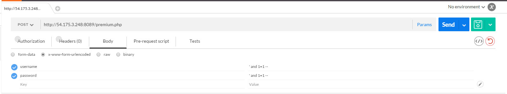
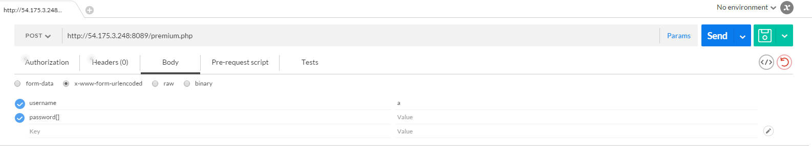

# CSAWCTF 2015: Lawn Care Simulator
----------
## Challenge details
| Contest        | Challenge     | Category  | Points |
|:---------------|:--------------|:----------|-------:|
| CSAWCTF 2015 | Lawn Care Simulator | Web |    200 |

**Description:**
>*http://54.175.3.248:8089/*

----------
## Write-up
We have the login page, which takes 2 argument username and password, and password is hashed on front with js md5;

- First we attempt to do some SQL injection, but without success


- let's try to make some sort of error, we send a password param as array


Eureka! Works like a charm.

```html
<html>
<head>
    <title>Lawn Care Simulator 2015</title>
    <script src="//code.jquery.com/jquery-1.11.3.min.js"></script>
    <script src="https://maxcdn.bootstrapcdn.com/bootstrap/3.3.5/js/bootstrap.min.js"></script> 
    <link rel="stylesheet" href="https://maxcdn.bootstrapcdn.com/bootstrap/3.3.5/css/bootstrap.min.css">
</head>
<body>
<h1>flag{gr0wth__h4ck!nG!1!1!</h1></body>
</html>
```

## Whay it works

- First let's look premium.php page

```php
...
    if (isset($_POST['password']) && isset($_POST['username'])) {
        $auth = validate($_POST['username'], $_POST['password']); 
        if ($auth){
            echo "<h1>" . $flag . "</h1>";
        }
        else {
            echo "<h1>Not Authorized</h1>";
        }
    }
...
```
And than the validate function

```php
function validate($user, $pass) {
    require_once 'db.php';
    $link = mysql_connect($DB_HOST, $SQL_USER, $SQL_PASSWORD) or die('Could not connect: ' . mysql_error());
    mysql_select_db('users') or die("Mysql error");
    $user = mysql_real_escape_string($user);
    $query = "SELECT hash FROM users WHERE username='$user';";
    $result = mysql_query($query) or die('Query failed: ' . mysql_error());
    $line = mysql_fetch_row($result, MYSQL_ASSOC);
    $hash = $line['hash'];

    if (strlen($pass) != strlen($hash))
        return False;

    $index = 0;
    while($hash[$index]){
        if ($pass[$index] != $hash[$index])
            return false;
        # Protect against brute force attacks
        usleep(300000);
        $index+=1;
    }
    return true;
}
```
So basically we need to send $username that did not exist and null $password, 
but becouse of this line

```php
 if (isset($_POST['password']) && isset($_POST['username']))
```

we can't send empty string, array is ok :)

gg wp hf